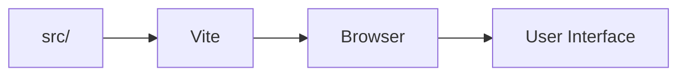

# 🧹 Cleanning-

<p align="center"></p>

<p align="center"><b>A Vite-powered frontend project focused on a clean, component-based web experience.</b></p>

<p align="center">  </p>

## 🚀 Getting Started
```bash
git clone https://github.com/Abhishek7258/Cleanning-.git
cd Cleanning-
npm install
npm run dev
```

Use the scripts in `package.json` as the source of truth for development, build and lint commands.

## 📁 Structure
```text
Cleanning-/
├── public/
├── src/
├── index.html
├── package.json
├── vite.config.js
└── eslint.config.js
```

## 🧩 Architecture


## 🖼️ Screenshots
For a polished project page, add real application screenshots under `docs/screenshots/` and reference them here.

## 🤝 Contributing
Keep components focused, preserve responsive behavior, and run lint/build checks before submitting changes.

## 📄 License
No license file is currently declared.